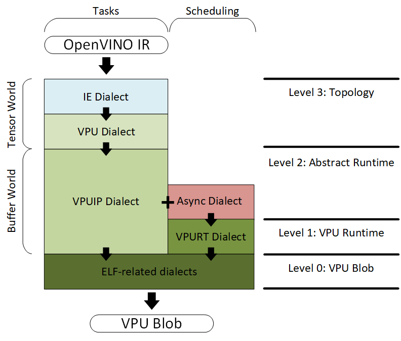
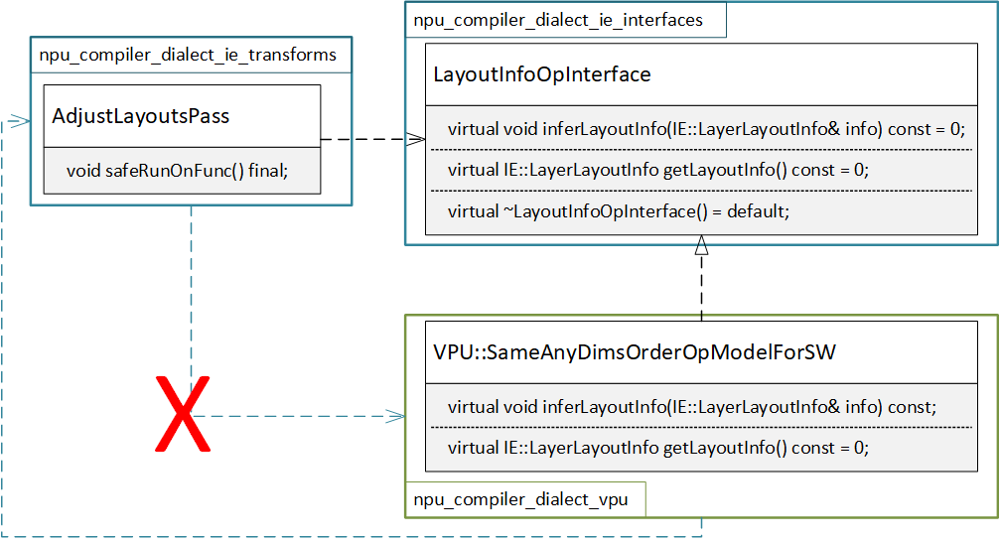
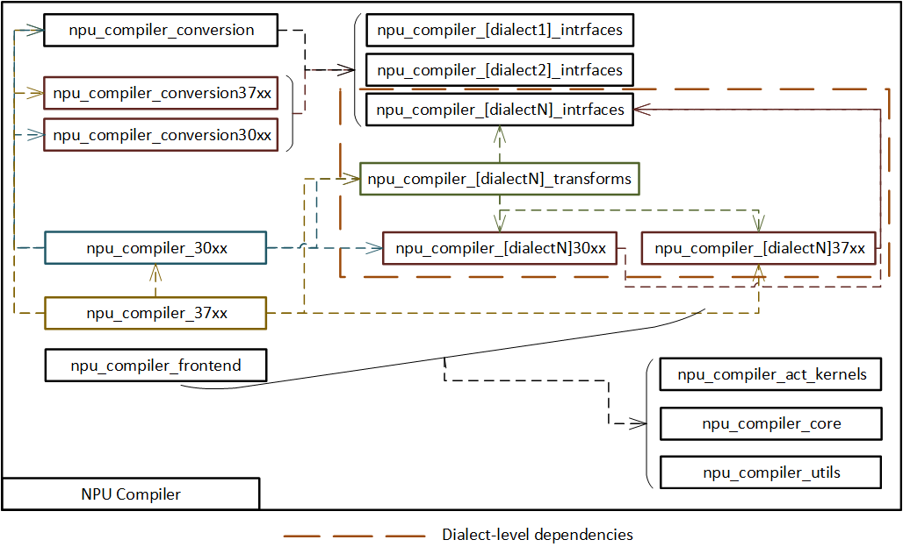
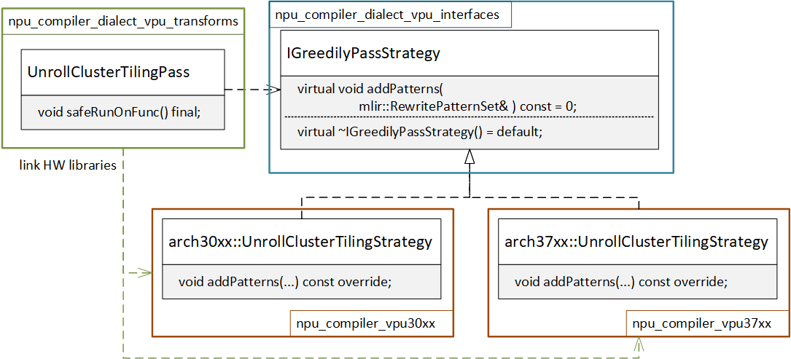
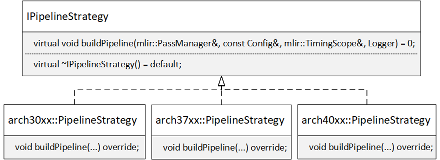
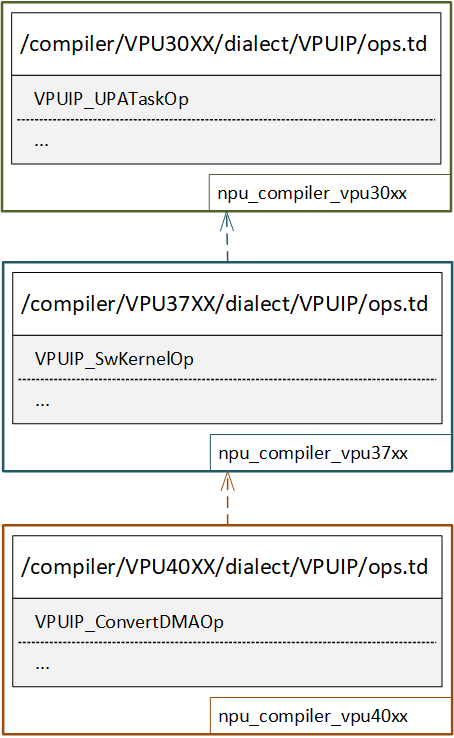
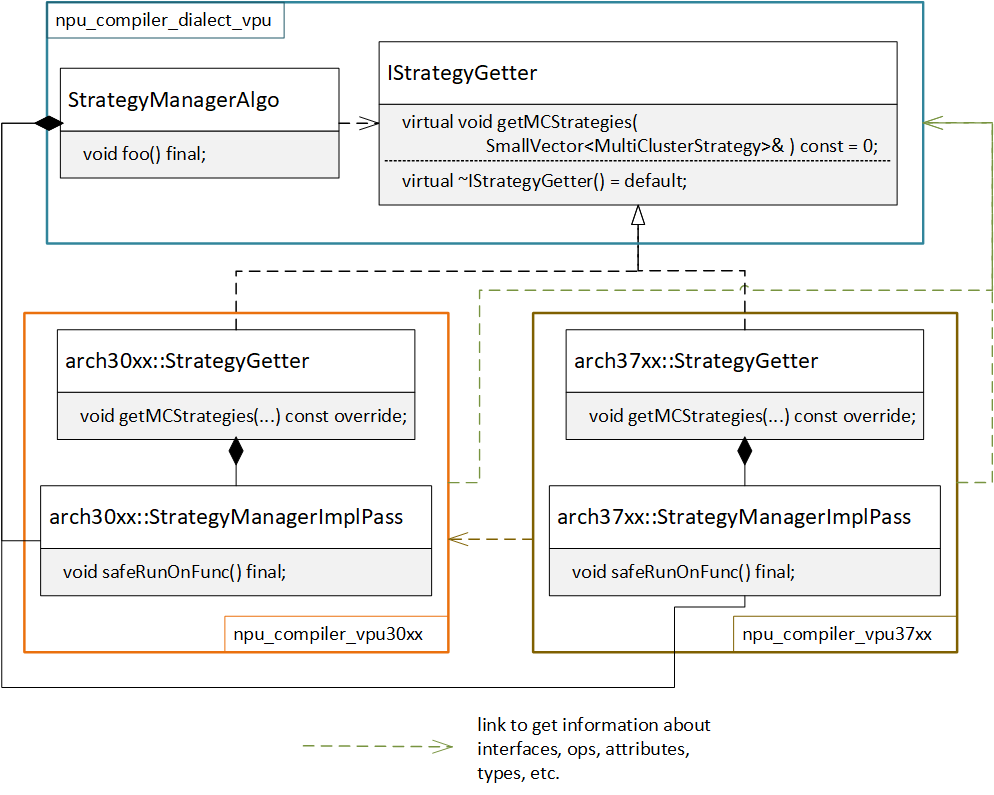

# Project structure

This document is written on the basis of discussions taken as part of the task of preparing the compiler for development in open-source. This means that (debatable) decisions on the structure of the project structure were made based on the following conditions:
- Enable/disable a specific platform by a CMake option and a corresponding define;
- Make a clear, convenient process of adding a new device;
- Ensure code reuse for different device generations.

## Compiler overview

### Dialects



Regardless of the device version, the compilation flow has the same appearance at the dialect level. These dialects represent different levels of detail. The IR is lowered from high level abstractions to more detailed representation step-by-step during compilation. The compilation pipeline consists of the "atomic“ passes. Each pass in compilation pipeline must represent one single transformation to reach one specific goal (either IR adaptation or IR optimization)..

It is also necessary to describe the dependence of dialects from an architectural point of view: 



Only a low-level dialect might depend on a high-level one, but not vice versa. Ideally, based on [DIP](https://en.wikipedia.org/wiki/Dependency_inversion_principle), they should all depend on abstraction. A simple example is shown in the diagram above: `AdjustLayoutsPass` pass is written in a general manner and depends on the `LayoutInfoOpInterface` interface, which is implemented in the VPU dialect. Thus `AdjustLayoutsPass` is protected from changes in HW details and can easily be reused. This example is somewhat simplified relative to the actual implementation. More information can be found in [MLIR Overview](https://mlir.llvm.org/docs/Interfaces) and [below](#operation-interfaces).

### Libraries



This high-level diagram covers the main dependencies between libraries inside the compiler. It makes sense to divide libraries into two "types": common and HW-specific.
Common part consists of:
- frontend: to import NGraph to IE dialect
- core: data structures required by compiler
- utils: helpers to work with core data structures
- act_kernels: shave utilities
- conversion: passes for lowering dialects
- [dialect]_IR: dialect operations, attributes and types
- [dialect]_transforms: passes to perform transformations over IR
- [dialect]_interfaces: interfaces and base classes on which passes may depend
- other utility libraries

HW-specific part consists of implementation of interfaces, passes, operations and other device-specific details/utilities. There is one library for each device version. For convenience, the diagram shows it in the form of separate libraries, so `npu_compiler_[dialectN]30xx` means the dialect folder in the [VPU30XX](../include/vpux/compiler/VPU30XX) directory.

## Passes

### Common passes

These are fully HW-agnostic passes. This means you will get the same result for any input IR regardless of the platform version. Such passes have to be placed in a common part. Please refer to [primer_mlir](primer_mlir.md#passes) to get more information.

### HW-specific passes

Hardware specific passes are designed to work on a particular platform. And from development perspective, the only difference is that necessary to use appropriate HW folder. For example, 30XX-specific passes for IE dialect:
- Declaration [path](../../tblgen/vpux/compiler/VPU30XX/dialect/IE/passes.td) in TableGen;
- Declaration [path](../../include/vpux/compiler/VPU30XX/dialect/IE/passes.hpp) for constructor;
- Implementation [folder](../../src/VPU30XX/dialect/IE/passes).

You are allowed to reuse passes from an older HW version for a newer one if the required feature is a strict superset:

```C++
// 37XX 
void vpux::buildDefaultHWModePipeline(mlir::OpPassManager& pm, const DefaultHWOptions37XX& options, Logger log) {
    // ...
    // Use pass from previous version here
    pm.addPass(IE::arch30xx::createHwSpecific1Pass(log));
    IE::buildName1Pipeline(pm, log);
    // ...
}
```

HW-specific passes must also be registered in [vpux-opt](../../../../tools/vpux-opt/vpux-opt.cpp) for validation purposes:

```C++
// ...
vpux::IE::arch30xx::registerIEPasses();
// ...
```

### "Mixed" passes

Mixed passes share a common core algorithm but utilise hardware specific information to make decisions.

#### Interface-based approach

Lets say we have `StrategyManager` pass in VPU dialect that can be applied for all HW generations. At the same time, the general algorithm from this pass needs information about possible strategies that are different for different devices. So we have to store strategies separately for HW components, because, for example, for the newest device it is private information.
 


Following this approach, the development of a "mixed" pass is similar to a common pass. The difference here is that we have to create a concrete instance of the corresponding type in the common part, using, for example, the factory method:

```C++
std::unique_ptr<IStrategyGetter> vpux::VPU::createMCStrategyGetter(ArchKind arch, int64_t numClusters) {
    switch (arch) {
    case ArchKind::VPUX30XX: {
        return std::make_unique<arch30xx::StrategyGetter>();
    }
    case ArchKind::VPUX37XX: {
        return std::make_unique<arch37xx::StrategyGetter>();
    }
    case ArchKind::UNKNOWN:
    default: {
        VPUX_THROW("Got UNKNOWN arch kind value");
    }
    }
}
```

This approach does not have the disadvantages of [rejected option](#interface-based-approach-rejected). But it has its downsides:
- A large number of factory methods need to be created. However, this problem can be mitigated by creating some sort of global register, like a DI container in C# or Java.
- Removing the module requires more effort, as the common part link the hardware library(CMake changes), and also need to remove code from factories(see previous point). The problem related to dependencies between libraries can be solved by switching to a plugin system, then we could load the necessary libraries in runtime depending on the arch value.

Please note that despite the dependence of the common part(`npu_compiler_dialect_passes_vpu`) on the HW-specific one(`npu_compiler_vpu30xx`), by design, classes do not depend on it. Here `StrategyManagerPass` depends on interface `IStrategyGetter` and `arch30xx::StrategyGetter` implements this — so both components depend on abstraction and we still follow [DIP](https://en.wikipedia.org/wiki/Dependency_inversion_principle).

This approach is adopted as the main one, as it reduces duplication and decreases the probability of errors in comparison with the [rejected option](#interface-based-approach-rejected).

#### Rewriter-based approach



In this example, the different behavior of the pass for different HWs is achieved by adding special rewriters. To do this, we use the interface again: `UnrollClusterTilingPass` depends on `IGreedilyPassStrategy`. And here is possible implementation of `UnrollClusterTilingPass::safeRunOnFunc` method:

```C++
void UnrollClusterTilingPass::safeRunOnFunc() {
    auto& ctx = getContext();
    auto func = getOperation();

    auto strategy = getGreedilyStrategy(func, _log);
    
    mlir::RewritePatternSet patterns(&ctx);
    // add necessary rewriters here
    strategy.addPatterns(patterns);

    if (mlir::failed(
                mlir::applyPatternsAndFoldGreedily(func, std::move(patterns), vpux::getDefaultGreedyRewriteConfig()))) {
        signalPassFailure();
    }
}
```

where `strategy` is `IGreedilyPassStrategy` and it can be implemented in different ways, depending on the version of the device:

```C++
// 30XX 
void UnrollClusterTilingStrategy::addPatterns(mlir::RewritePatternSet& patterns) {
    auto module = _func->getParentOfType<mlir::ModuleOp>();
    auto dmaOp = IE::getAvailableExecutor(module, VPU::ExecutorKind::DMA_NN);
    auto dmaPortCount = dmaOp.getCount();

    patterns.add<VPUIP::ClusterDMARewriter>(&_ctx, dmaPortCount, _log);
    patterns.add<VPUIP::arch30xx::ClusterNCERewriter>(&_ctx, _log);
}

// 37XX 
void UnrollClusterTilingStrategy::addPatterns(mlir::RewritePatternSet& patterns) {
    auto module = _func->getParentOfType<mlir::ModuleOp>();
    auto dmaOp = IE::getAvailableExecutor(module, VPU::ExecutorKind::DMA_NN);
    auto dmaPortCount = dmaOp.getCount();

    patterns.add<VPUIP::ClusterDMARewriter>(&_ctx, dmaPortCount, _log);
    // Compared to the 30xx, we have also arch37xx::ClusterSWRewriter here
    patterns.add<VPUIP::arch37xx::ClusterSWRewriter>(&_ctx, module, _log);
    patterns.add<VPUIP::arch30xx::ClusterNCERewriter>(&_ctx, _log);
}
```

Rewriters can also depend on interfaces to write them in the most general form — kind of combination with [Interface-based approach](#interface-based-approach). In this case, the necessary objects can be created directly in `addPatterns` method.
This approach also helps reducing code duplication since allow not to register pass for each device. Then we can use the same name in `vpux-opt` and manage behavior of pass using only `vpu-arch`:

```MLIR
// RUN: vpux-opt --split-input-file --init-compiler="vpu-arch=VPUX37XX allow-custom-values=true" --unroll-cluster-tiling  %s | FileCheck %s
```

instead of, for example, duplicating the device version in the pass name:

```MLIR
// RUN: vpux-opt --split-input-file --init-compiler="vpu-arch=VPUX37XX allow-custom-values=true" --unroll-cluster-tiling-VPUX37XX  %s | FileCheck %s
```

More detailed information about vpux-opt can be found in the [how-to-test](../../../../guides/how-to-test.md) document.

### Canonicalization

TODO: #-86282

## Pipelines

Compiler has different pipeline for different HW generation. These pipelines are stored in appropriate HW folders: [VPU30XX](../include/vpux/compiler/VPU30XX/pipelines.cpp), [VPU37XX](../include/vpux/compiler/VPU37XX/pipelines.cpp), etc. To build a pipeline, it is also necessary to implement `IPipelineStrategy` interface for each device: 



Then it is used in this way:

```C++
auto pipelineFactory = createPipelineStrategy(arch);
// pm is PassManager
pipelineFactory->buildPipeline(pm, config, rootTiming, log);
```

The main advantage of this approach is that we can easily hide the pipeline for a new device containing HW-specific passes. The consequence of this separation is that there is no need to add passes to the pipeline that do not work with this device. Therefore, the size of the pipeline becomes smaller, only the necessary passes are involved. And it is possible to get rid of such code:

```C++
void MyPass::safeRunOnFunc() {
    // ...
    if (arch != VPU::ArchKind::VPUX30XX) {
        return mlir::failure();
    }
    // ...
}
```

This approach also has a downside. It is not clear why this or that pass participates in one pipeline, but not in another. Are there HW restrictions or did developer forget to add it? A possible solution is to introduce as many sub-pipelines as possible to bring the main pipeline to a similar form:

```C++
// Only sub-pipelines and HW-specific passages should remain in the main pipeline
// 30XX 
void vpux::buildDefaultHWModePipeline(mlir::OpPassManager& pm, const DefaultHWOptions30XX& options, Logger log) {
    // ...
    IE::buildName1Pipeline(pm, log);
    pm.addPass(IE::arch30xx::createHwSpecific1Pass(log));
    IE::buildName2Pipeline(pm, log);
    IE::buildName3Pipeline(pm, log);
    // ...
}

// 37XX 
void vpux::buildDefaultHWModePipeline(mlir::OpPassManager& pm, const DefaultHWOptions37XX& options, Logger log) {
    // ...
    IE::buildName1Pipeline(pm, log);
    IE::buildName2Pipeline(pm, log);
    pm.addPass(IE::arch37xx::createHwSpecific2Pass(log));
    IE::buildName3Pipeline(pm, log);
    // ...
}
```

Some [recommendations](../code_style.md#pipelines-and-passes) are already written in code style.

## Operation interfaces

[Interfaces](https://mlir.llvm.org/docs/Interfaces/#attributeoperationtype-interfaces) and [External models](https://mlir.llvm.org/docs/Interfaces/#external-models-for-attribute-operation-and-type-interfaces) are powerful tools that allow us to add the necessary behavior for operations in runtime. A typical example is the [AdjustLayoutsPass](../../src/dialect/IE/passes/adjust_layouts.cpp) pass. It works with the [IE::LayoutInfoOpInterface](../../tblgen/vpux/compiler/dialect/IE/ops_interfaces.td) interface. For the same operation from IE dialect we want to have different results depending on the device version. For this purpose, different models can be implemented and then are attached for the same operation depending on device version:

```C++
// 30XX:
IE::SigmoidOp::attachInterface<vpux::VPU::SameInOutDimsOrderOpModelForSW_CHW_HWC_NCHW_NHWC>(*ctx);

// 37XX:
IE::SigmoidOp::attachInterface<vpux::VPU::SameAnyDimsOrderOpModelForSW>(*ctx);
```

Interfaces registration follows the same schema as the pipelines registration:


```C++
auto interfacesRegistry = createInterfacesRegistry(arch);
interfacesRegistry->registerInterfaces(registry);
```

## Properties

TODO: #-66795. Store properties in module; Handle properties in passes.

## Operations



TODO: #-86281

There is no complex solution here yet. As a first step, operations are devided between several `ops.td` files depending on the HW version. And the logic of transformations again is based on op-interfaces.

In future we could proceed with HW-specific dialects if necessary:
- VPUIP30XX_UPATaskOp
- VPUIP37XX_SwKernelOp
- ..

For example, we already have HW-specific dialects like [VPUMI37XX](../../tblgen/vpux/compiler/dialect/VPUMI37XX/dialect.td).

## Attributes

TODO: #-88494

## Rationale

### "Mixed" passes

#### Interface-based approach (rejected)



Here in common part we have `StrategyManagerImplAlgo` class (it can also be a method, but it doesn't really matter), which contains the basic general logic. This class depends on the interface to be specified by HW details, in our case, a specific set of strategies.
This scheme requires the developer to register a pass for each platform:

```MLIR
// src/vpux_compiler/tblgen/vpux/compiler/VPU30XX/dialect/VPU/passes.td
// The same for 37XX
def StrategyManagerPass : PassBase<"strategy-manager", "mlir::OperationPass<mlir::func::FuncOp>"> {
    // ...
    let constructor = "vpux::IE::arch30xx::createStrategyManagerPass()";
    // ...
}
```

The implementation of HW passes is also duplicated for each platform. Possible way:

```C++
void StrategyManagerPass::safeRunOnFunc() {
    auto func = getOperation();
    auto module = func->getParentOfType<mlir::ModuleOp>();

    // in case of 37XX we have to create arch37xx::StrategyGetter
    StrategyManagerImplAlgo algo {func, std::make_unique<arch30xx::StrategyGetter>();}
    algo.foo();
}
```

Then we will have the difference in compilation pipelines:

```C++

void vpux::buildDefaultHWModePipeline(mlir::OpPassManager& pm, const DefaultHWOptions30XX& options, Logger log) {
    // ...
    // Accordingly, it will be arch37xx::createStrategyManagerPass for 37XX, etc.
    pm.addPass(VPU::arch30xx::createStrategyManagerPass(log));
    // ...
}
```

The advantage of this approach is that the HW library itself creates the necessary dependencies for the generic algorithms, and therefore minimal changes are required to remove such a library from the repository: platform libraries depend on the generic part, and not vice versa.

At the same time there are several cons:
- Code duplication for declaration and implementation of the pass;
- Impossible to reuse sub-pipelines: we can't have common sub-pipeline for 37xx with this pass;
- It is easy to make a mistake when registering passes for vpux-opt. You get an error when trying to register passes for from 37XX at the same time, because two passes are registered with the same name.
